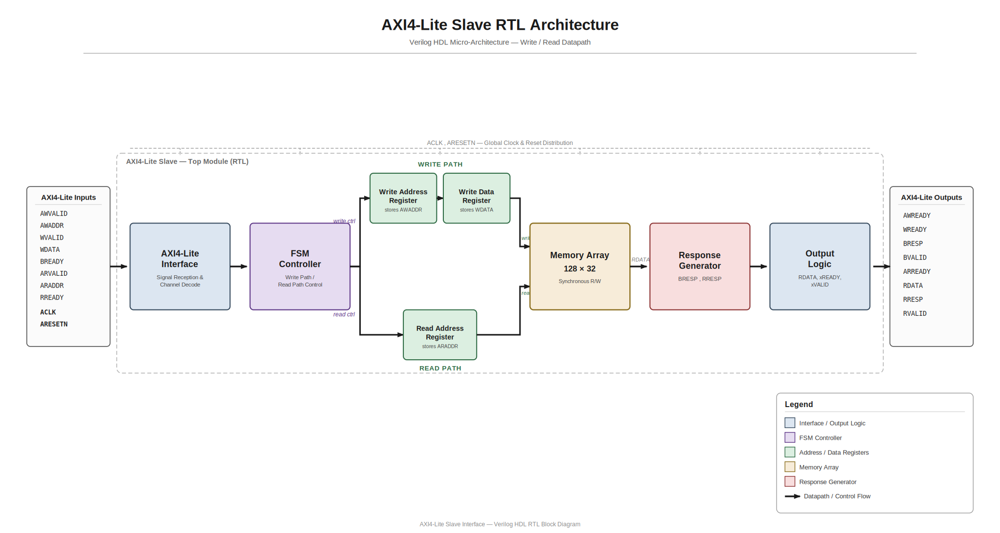
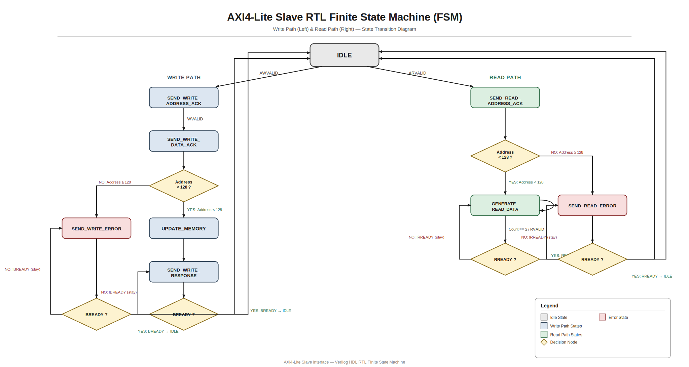
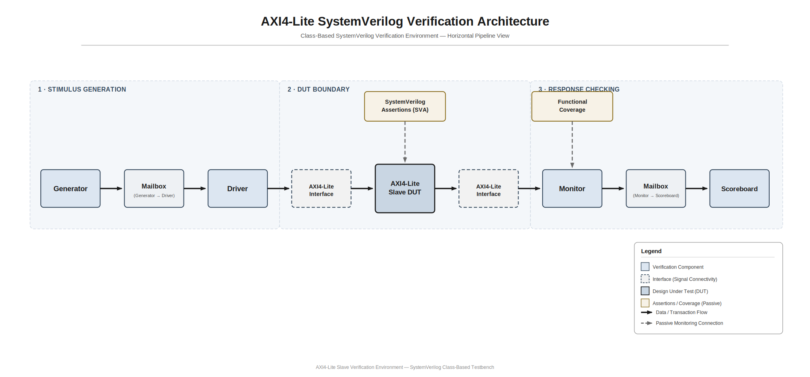

# AXI4-Lite Slave Interface RTL Design and SystemVerilog Verification


---

## Project Overview

This project implements a simplified **AXI4-Lite Slave Interface** in Verilog HDL and verifies its functionality using a **SystemVerilog class-based constrained-random verification environment**.

The design supports single-beat read and write transactions with parameterized memory and includes functional coverage, SystemVerilog Assertions (SVA), constrained-random stimulus generation, protocol checking, and scoreboard-based data verification.

---

## Features

### RTL Design

- AXI4-Lite Slave Interface
- Single-beat Read and Write Transactions
- Parameterized 128-word Memory
- FSM-based Control Logic
- OKAY and SLVERR Response Generation
- Address Boundary Checking

---

### Verification Environment

- Class-Based SystemVerilog Testbench
- Constrained Random Transaction Generation
- Driver
- Monitor
- Scoreboard
- Environment Class
- Mailbox-based Communication
- Event Synchronization
- Functional Coverage
- SystemVerilog Assertions

---

## Repository Structure

```
AXI4-Lite-Slave-SystemVerilog-Verification
│
├── RTL
│   └── axilite_s.v
│
├── Verification
│   ├── interface.sv
│   ├── transaction.sv
│   ├── generator.sv
│   ├── driver.sv
│   ├── monitor.sv
│   ├── scoreboard.sv
│   ├── environment.sv
│   ├── axi_assertions.sv
│   └── tb.sv
│
├── Verilog_TB
│   └── tb_axilite.v
│
├── Simulation
│
├── Docs
│
└── README.md
```

---


## RTL Block Diagram

The AXI4-Lite Slave RTL is implemented using an FSM-based architecture. The design contains separate read and write datapaths controlled by a finite state machine (FSM). The controller manages AXI4-Lite handshaking, memory access, and response generation.

<p align="center">
    
</p>


## RTL Finite State Machine (FSM)

The AXI4-Lite Slave controller is implemented as a finite state machine (FSM). The controller manages separate write and read transaction flows, handling AXI4-Lite handshaking, address validation, memory access, and response generation.

The write path processes address and data transactions before updating memory and generating write responses. The read path validates the address, retrieves data from memory, and returns the appropriate read response.

<p align="center">
  
</p>

## Verification Architecture

The verification environment is implemented using a SystemVerilog class-based constrained-random testbench. Transactions are generated by the Generator, driven to the DUT through the Driver, monitored by the Monitor, and checked by the Scoreboard. Functional Coverage and SystemVerilog Assertions (SVA) ensure verification completeness and protocol compliance.

<p align="center">
  
</p>
---

# Verification Components

| Component | Description |
|------------|-------------|
| Generator | Creates constrained-random AXI transactions |
| Driver | Drives transactions to DUT |
| Monitor | Samples DUT responses and collects coverage |
| Scoreboard | Compares expected vs actual results |
| Environment | Connects all verification components |
| Assertions | Protocol checking using SVA |

---

# Functional Coverage

Coverage is collected in the monitor using SystemVerilog covergroups.

The following metrics are tracked:

- Read / Write Operations
- Address Ranges
- Write Data
- Read Data
- BRESP
- RRESP
- Cross Coverage

### Final Coverage

| Coverage Type | Result |
|---------------|--------|
| Operation | 100% |
| Address | 100% |
| Data | 91.67% |
| Response | 100% |
| Cross Coverage | 85.71% |
| **Overall Functional Coverage** | **95.48%** |

---

# SystemVerilog Assertions

The following protocol properties are verified:

- AWREADY sequencing
- WREADY sequencing
- ARREADY sequencing
- BRESP validity
- RRESP validity
- BRESP stability
- RDATA stability

All assertions passed successfully.

---

# Simulation Results

```
Scoreboard Summary

Transactions : 100
PASS         : 100
FAIL         : 0

RESULT : TEST PASSED
```

```
Coverage Summary

Overall Functional Coverage : 95.48%
```

```
Assertion Summary

Total Assertions : 7
Passed           : 7
Failed           : 0

RESULT : ALL ASSERTIONS PASSED
```

```
FINAL VERIFICATION SUMMARY

Transactions        : 100
Scoreboard Status   : PASS
Functional Coverage : 95.48%
Assertions          : PASS

OVERALL RESULT

VERIFICATION PASSED
```

---

# Tools Used

- Verilog HDL
- SystemVerilog
- EDA Playground
- Git
- GitHub

---

# Future Improvements

- UVM-based Verification Environment
- Functional Coverage Driven Randomization
- Reference Model
- Protocol Checker
- AXI Burst Transactions
- AXI4 Full Support
- Coverage Closure Automation

---

# Author

**Sachin Kumar Mishra**

MNNIT Allahabad

Interested in RTL Design, Functional Verification and Digital Design.

GitHub:
https://github.com/sachin4144
